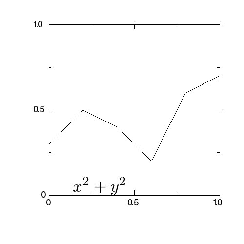
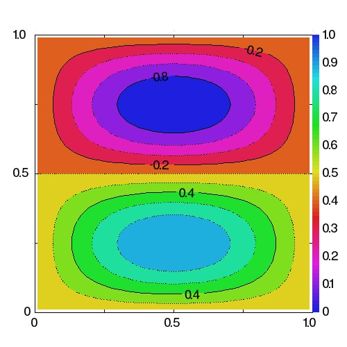

# gr-crystal
Crystal binding for GR framework

A (still incomplete) interface to GR framework from Crystal

## Installation

You need to place grlib.cr in your Crystal's require search path.

You also need to install GR in the standard way and set the
enviromental variable GRDIR point to the installed directory.

## Getting started

Download grsample.cr and

   crystal grsample.cr

should show a simple plot.

* GRDIR env variable should point to the directory where you placed
  gr files. In particular,  lib and fonts directories should be there
* GKS_WSTYPE env variable should be set. For X11, its value should
  be "x11".
  

## Usage

Essentially the same as that for C binging. Difference:

* All size+pointer arguments to C array are replaced by  Crystal
  arrays.

* C char* is replaced by Crysral Sring

### Example of API

    void gr_polyline(int, double *, double *)

is called as

    GR.polyline(Array(Float64), Array(Float64))

## Examples

[polyline plot](./grsample.cr)

[contour plot](./grcontour.cr)

## Todo

All source and documents should be generate automatically...
