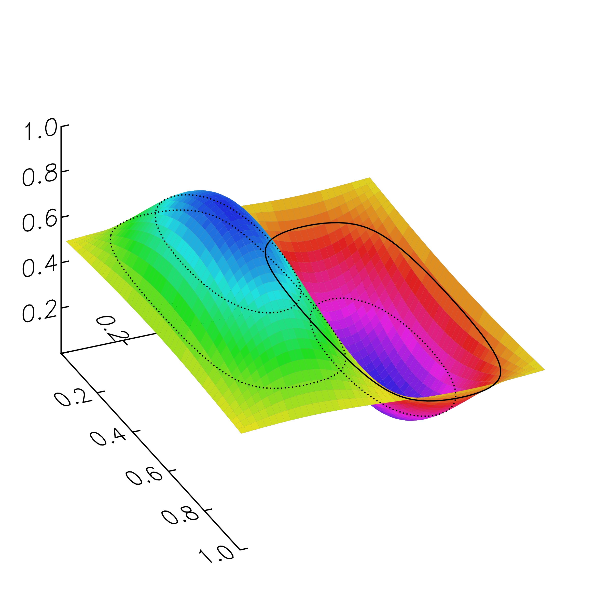
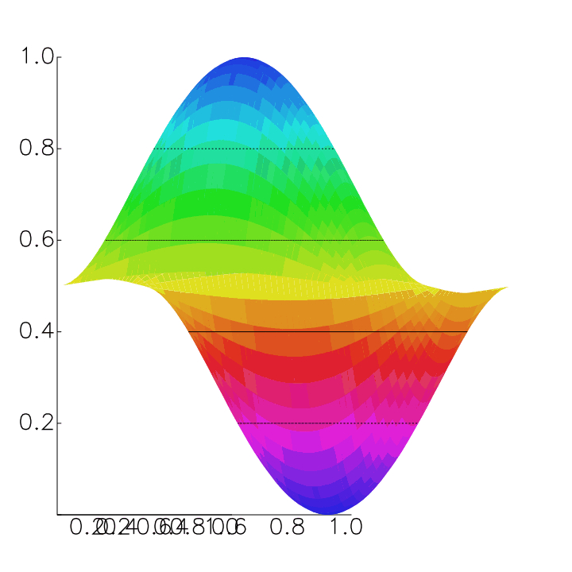
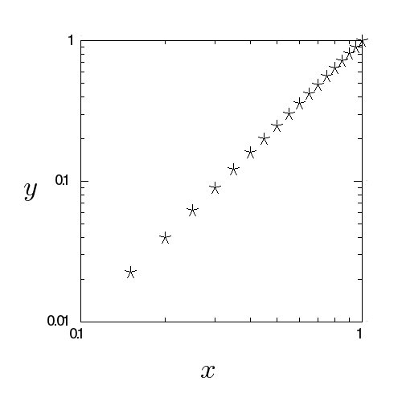
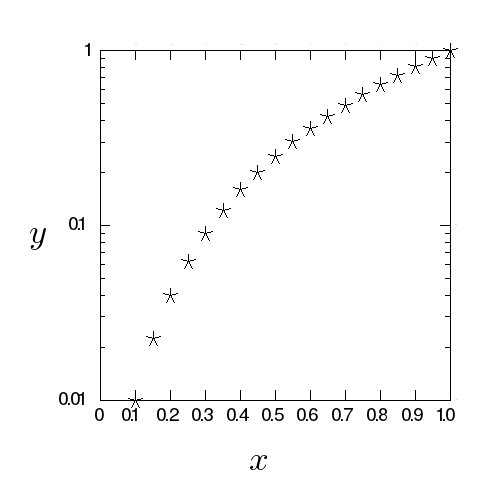

# gr-crystal
Crystal binding for GR framework

A (still incomplete) interface to GR framework from Crystal


## Installation


0. You need to install GR in the standard way and set the enviromental variable GRDIR point to the installed directory.

1. Add the dependency to your `shard.yml`:

   ```yaml
   dependencies:
     clop-crystal:
       github: your-github-user/clop-crystal
   ```

2. Run `shards install`


## Getting started

Download grsample.cr and

   crystal grsample.cr

should show a simple plot.

* GRDIR env variable should point to the directory where you placed
  gr files. In particular,  lib and fonts directories should be there
* GKS_WSTYPE env variable should be set. For X11, its value should
  be "x11".
  

## Usage

Essentially the same as that for C binging. Difference:

* All size+pointer arguments to C array are replaced by  Crystal
  arrays.

* C char* is replaced by Crysral Sring

### Example of API

    void gr_polyline(int, double *, double *)


is called as


    GR.polyline(Array(Float64), Array(Float64))

## Examples

[polyline plot](./grsample.cr)


[contour plot](./grcontour.cr)


[3d contour plot](./grcontour3d.cr)



[3d animation](./gr3drotate.cr)



[log-log plot](./grloglogsample.cr)



[semilog plot](./grsemilogsample.cr)




## Todo

All source and documents should be generated automatically...
